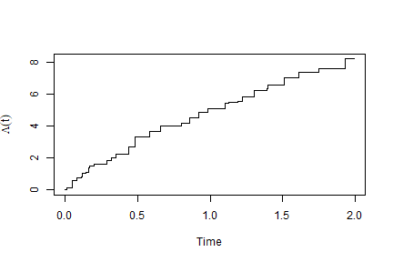

# panelrate

Regression analysis of **panel count data**: recurrent events observed only at
intermittent examination times, so that you know how many events happened
between visits but not when. `panelrate` fits the semiparametric proportional
rate model

$$E[dN(t) \mid X(t)] = \exp(\beta' X(t)) \, d\Lambda(t),$$

allowing the covariates to vary over time, and implements the estimation and
covariance methods of Sun, Guo, Li, Tu and Sun (2024),
[*Bernoulli* **30**(4), 3251--3275](https://doi.org/10.3150/23-BEJ1713).

## Why the rate model

With time-varying covariates the competing proportional *means* model
$E[N(t) \mid X(t)] = \mu(t)\exp(\beta'X(t))$ requires $\mu$ to be
non-decreasing, which is awkward to guarantee when covariate values fluctuate,
and its predicted mean curves need not be monotone. The rate model only needs
the right hand side to be positive, so predicted means are non-decreasing by
construction, and $\exp(\beta'X(t))$ reads as an instantaneous relative risk in
the same way a hazard ratio does in survival analysis.

## Installation

```r
# install.packages("remotes")
remotes::install_github("commintern/panelrate")
```

## Usage

Data go in counting process form, one row per interval over which the
covariates are constant. A row whose `count` is a number records an examination
at `tstop`; a row whose `count` is `NA` records only that a covariate changed.


``` r
library(panelrate)
set.seed(1)

d <- r_panel_count(150, beta = c(1, -1), lambda = function(t) 8 / (1 + t))
head(d)
#>   id   tstart    tstop count        x1        x2
#> 1  1 0.000000 0.380000     1 0.8983897 0.6607978
#> 2  1 0.380000 1.070000     3 0.8983897 0.6607978
#> 3  1 1.070000 1.258228    NA 0.8983897 0.6607978
#> 4  1 1.258228 1.700000     4 0.9446753 0.6607978
#> 5  2 0.000000 0.210000     2 0.7829328 0.5297196
#> 6  2 0.210000 0.800000     2 0.7829328 0.5297196

fit <- panelrate(PanelCount(id, tstart, tstop, count) ~ x1 + x2, data = d)
summary(fit)
#> 
#> Call:
#> panelrate(formula = PanelCount(id, tstart, tstop, count) ~ x1 + 
#>     x2, data = d)
#> 
#> Proportional rate model for panel count data
#> Standard errors: robust sandwich
#> 
#>    Estimate Std. Error z value Pr(>|z|)
#> x1   1.1810     0.1270   9.303   <2e-16
#> x2  -1.0283     0.1056  -9.738   <2e-16
#> 
#> 150 subjects, 631 examinations, 1169 events, 187 distinct examination times.
#> Log likelihood -830.8 in 312 EM iterations.
```

If covariates are time-invariant, one row per examination is enough and the
three argument form fills in the interval starts:

```r
panelrate(PanelCount(id, time, count) ~ x1 + x2, data = visits)
```

## Choosing a covariance estimator

Estimation maximises the likelihood a Poisson process would give, but that
assumption is only a working device. Three covariance estimators are available:

| `vcov(fit, type =)` | What it is | Needs the Poisson assumption? |
|---|---|---|
| `"robust"` (default) | sandwich $\Omega^{-1} S \Omega^{-1}/n$ | no |
| `"information"` | efficient information $S^{-1}/n$ | yes |
| `"profile"` | Murphy--van der Vaart profile likelihood | yes |

When counts are overdispersed relative to Poisson, which is the usual situation,
the last two understate the standard errors, sometimes by a factor of five or
more. The robust estimator costs nothing extra beyond quantities the EM
algorithm has already produced.


``` r
set.seed(2)
od <- r_panel_count(150, frailty = 1)   # gamma frailty: not a Poisson process
odfit <- panelrate(PanelCount(id, tstart, tstop, count) ~ x1 + x2, data = od)
rbind(robust      = sqrt(diag(vcov(odfit, "robust"))),
      information = sqrt(diag(vcov(odfit, "information"))))
#>                    x1         x2
#> robust      0.3044926 0.33010802
#> information 0.0465893 0.03599234
```

## The baseline and predictions


``` r
head(baseline(fit))
#>   time         jump   cumrate
#> 1 0.01 1.235997e-01 0.1235997
#> 2 0.02 0.000000e+00 0.1235997
#> 3 0.03 0.000000e+00 0.1235997
#> 4 0.04 6.947206e-35 0.1235997
#> 5 0.05 4.677466e-01 0.5913463
#> 6 0.06 4.839548e-67 0.5913463
plot(fit)
```



``` r

head(predict(fit, d, type = "mean"))
#>   id time      mean
#> 1  1 0.01 0.1810132
#> 2  1 0.02 0.1810132
#> 3  1 0.03 0.1810132
#> 4  1 0.04 0.1810132
#> 5  1 0.05 0.8660341
#> 6  1 0.06 0.8660341
```

## Citation

```r
citation("panelrate")
```
